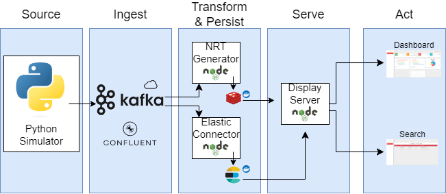

# About
A data pipeline that processes artificial data generated randomly that represents pizza orders that come from different branches of a pizza chain.  
See the diagram below for a general outline of the pipeline and the technologies used.
### Pipeline Diagram

# System Description
The pipeline processes two types of events - 'orders' and 'open-close-events'.  

- Branches are detailed in [branches.json](sharedfiles/branches.json), they can either be kosher or non-kosher.  
- Branches that are kosher only serve kosher pizza toppings and non-kosher branches serve both kosher and non-kosher toppings.  
- Each order details one pizza order with up to 8 toppings chosen randomly from the options that are stored in [pizza_toppings.json](sharedfiles/pizza_toppings.json).
- Each order consists of two events - "order received" and "order finished"

## Simulator
  
Every tick the simulator generates 'orders' and 'open-close-events' events:  
1. a variable amount of order events from a variable amount of branches.  
2. a variable amount of randomly chosen branches are opened/closed with a certain probability

The events are sent as JSON objects to their corresponding topic on the _**Confluent Kafka**_ cloud service.

## Hot Part

The hot part of the pipeline consists of a **Node.js** server and a **Redis** database on a **Docker** container.  
The server consumes the Kafka messages and processes them to create some statistics which are constantly pushed to the Redis database.
Example Statistics are listed below:
- Open Branches
- Average Service Time
- Total Orders Today
- Open Orders
  
This mechanism generates Near Real Time data which is displayed later in the system.  

## Cold Part
The cold part of the pipeline consists of a **Node.js** connector server that consumes the Kafka messages and stores them in an **Elastic Search** database on a **Docker** container.  
This mechanism serves to persist data for future querying and data analysis.  

## Serve
The final stop in the pipeline is a **Node.js** server that serves a web application containing a dashboard tab and search tab.
The NRT info is read by the Node.js server and constantly updated in the view using **socket.io**.
Past orders can be queried from the Elastic Search database in the Search tab by branch name and date.

# Preview
[Dashboard screenshot](images/dashboard.png)
[Search screenshot](images/search.png)
